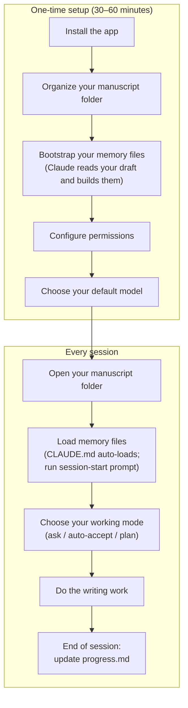

# Claude Code for Writers: A Practical Guide

## Before You Begin

This guide is written for Tim — a non-technical author with a finished first draft who wants to use Claude Code as a serious revision and writing partner. You don't need to know anything about programming, terminals, or code. Everything is plain English, step by step.

There are two parts to getting started: a **one-time setup** that takes roughly 30–60 minutes, and a **repeatable daily workflow** you'll use every session after that. The setup is front-loaded on purpose — doing it right the first time means every session after is fast and frictionless.

**Read this guide top to bottom before you do anything.** The sections build on each other. If you jump ahead to "Basic Usage" without doing the setup first, Claude won't know anything about your book and you'll spend the first ten minutes of every session re-explaining it.

Here's the full picture of where you're going:



---

### If you get stuck

Don't struggle alone. Claude Code is well-documented and the broader AI community knows it well — if something isn't working, **ChatGPT, Grok, or any other AI assistant can help you troubleshoot** just by describing what's happening.

That said, once Claude Code is up and running, **ask it first.** Claude Code is remarkably good at diagnosing its own issues. Describe what went wrong, and it will typically propose a fix and apply it itself. Nine times out of ten, that's all you need.

---

## Table of Contents

1. [What is Claude Code?](#1-what-is-claude-code)
2. [Honest Expectations](#2-honest-expectations)
3. [Installing Claude Code](#3-installing-claude-code)
4. [Getting Set Up](#4-getting-set-up)
5. [Configuring Permissions](#5-configuring-permissions)
6. [Choosing the Right Model](#6-choosing-the-right-model)
7. [Your First Session](#7-your-first-session)
8. [Practical Workflows for Book Writing](#8-practical-workflows-for-book-writing)
9. [Prompting Tips](#9-prompting-tips)
10. [Example Prompts to Copy and Use](#10-example-prompts-to-copy-and-use)

---

## 1. What is Claude Code?

Claude Code is an AI writing partner that runs as a desktop app on your computer. Think of it like a very capable collaborator you can have a conversation with — one who can read your drafts, help you brainstorm, suggest edits, and talk through story problems with you.

The key difference between Claude Code and a web chatbot like Claude.ai is that Claude Code runs on your own computer and can directly read and work with your manuscript files. You don't have to copy and paste anything into a browser tab. You can say "read chapter three and tell me if the pacing feels slow" — and it will actually open the file and read it.

It's also aware of your whole writing folder at once. If you ask it to check whether a character detail in chapter eight is consistent with what you established in chapter two, it can read both files and compare them. That kind of whole-manuscript awareness is what makes it genuinely useful for long-form book work.

---

## 2. Honest Expectations

Read this before investing time in the setup — so you know exactly what you're getting into, and what you're not.

**It doesn't browse the internet by default — but it can, with setup.** Out of the box, Claude Code works from its training knowledge, not live web data. If you ask about a historical detail, it will give its best answer from what it already knows — which may be accurate or may not be. Always verify factual claims through your own research, especially anything historical, scientific, or legal.

> That said, web search *can* be added to Claude Code via something called an MCP server. It requires obtaining an API key from a service like Brave Search and editing a configuration file — not difficult for a developer, but a non-trivial step for a non-technical user. If you later want to explore this, ask Claude Code to walk you through setting up a web search MCP server and it will guide you step by step.

**It doesn't remember your book between sessions — but this is fully fixable.** Every session starts fresh. The entire point of Section 4 in this guide is to solve this: with `CLAUDE.md`, `book-bible.md`, and `progress.md` set up, Claude comes back up to speed in 30 seconds at the start of any session.

**It can produce competent prose that has no soul.** Claude Code is good at writing sentences that are technically correct and structurally sound. What it can't do is care about your book the way you do. Its suggestions will sometimes be generic, safe, or slightly off-voice. Your job is to know when something isn't right and push back — or throw it out and write it yourself. Treat everything it produces as raw material, not a finished answer.

**It can't make the final calls.** It can give you three ways a scene could end, but it cannot tell you which one is true to your characters or serves your book. That judgment is yours and only yours. Claude Code is a tool for generating options and pressure-testing your thinking — not for deciding.

None of these are reasons not to use it. They're just the shape of the collaboration: Claude handles volume and speed, you handle judgment and voice.

---

## 3. Installing Claude Code

### What you'll need first

- A computer running macOS or Windows (Linux is not currently supported)
- An internet connection
- A **paid Claude subscription** — Pro, Max, Team, or Enterprise (see note below)

> **A note on cost:** Claude Code requires a paid Claude subscription. As of 2025, the Pro plan is $20/month. This is the same account you'd use at [claude.ai](https://claude.ai). If you're already a Claude subscriber, you're all set. If not, you'll need to sign up at [claude.ai](https://claude.ai) before proceeding.

---

### On macOS

**Step 1: Download the app**

Go to [claude.ai/download](https://claude.ai/download) and download the macOS version. It will download a `.dmg` file — the same kind of installer used for most Mac apps.

**Step 2: Install it**

Open the downloaded `.dmg` file. A window will appear asking you to drag the Claude icon into your Applications folder. Do that, then open your Applications folder and double-click Claude to launch it.

**Step 3: Sign in and open Claude Code**

Sign in with your Anthropic account. Once you're in, look for the **Code** tab at the top of the window and click it. This is the Claude Code interface.

---

### On Windows

**Step 1: Download the app**

Go to [claude.ai/download](https://claude.ai/download) and download the Windows version. It will download a `.exe` installer file.

**Step 2: Install it**

Double-click the downloaded file and follow the installer prompts. Accept the defaults — there's nothing unusual to configure.

**Step 3: Install Git (one-time setup)**

Claude Code on Windows requires Git, a free tool, to be installed separately. Go to [git-scm.com](https://git-scm.com) and download the Windows version. Run the installer and accept all the defaults.

**Step 4: Sign in and open Claude Code**

Launch Claude from your Start menu. Sign in with your Anthropic account, then click the **Code** tab at the top of the window.

---

## 4. Getting Set Up

This is your one-time setup. By the end of this section, Claude will know your book — your characters, your timeline, your voice, where the draft currently stands — and will carry that knowledge into every session automatically.

You don't need to organize your folder manually or fill in any files by hand. Claude does that from your existing draft. Your only job is to point it at your manuscript and review what it builds.

> **Back up first.** Before anything else, make sure your manuscript is in a folder synced to iCloud, Google Drive, or Dropbox. This gives you version history if anything ever gets changed unexpectedly. It takes two minutes and you'll never regret it.

---

### Step 1: Get your draft into a plain text format

Claude Code reads plain text files (`.txt` or `.md`). It cannot read `.docx` Word files directly.

If your draft is in Microsoft Word:
- Open your document in Word
- Go to **File → Save As**
- Choose **Plain Text (.txt)** as the format
- Save it into a dedicated folder for your book (e.g., a folder called `my-novel` on your Desktop)

If your draft is one big document, save it as a single file (e.g., `manuscript.txt`). If it's already split into chapters, save each one separately (`chapter-01.txt`, `chapter-02.txt`, etc.). Either way works — Claude will handle it.

---

### Step 2: Open the folder in Claude Code

Launch the Claude Code desktop app, click the **Code** tab, then click **Select folder** and navigate to your manuscript folder. Claude now has access to everything in it.

---

### Step 3: Run the setup sequence

Use the following prompts in order. After each one, **read what Claude produces before sending the next prompt.** This isn't a step to rush — what Claude builds here becomes the foundation of every session going forward.

**First — have Claude read the full manuscript:**

```
Read all the files in this folder. I want you to read the complete manuscript before we do anything else. When you're done, say "done reading" and wait for my next instruction.
```

**Second — have Claude organize the folder:**

```
Now set up a clean folder structure for this project. Do the following:
- If the manuscript is one large file, split it into individual chapter files named chapter-01.md, chapter-02.md, etc., based on the chapter breaks in the text
- If it's already split, rename the files consistently using that same format
- Create a subfolder called .claude and inside it create a file called settings.json with this content:
  { "permissions": { "defaultMode": "acceptEdits" } }
- Don't change any of the actual writing — only the file organization

When done, show me the new folder structure.
```

**Third — have Claude build the book bible:**

```
Based on everything you read, create a file called book-bible.md. Include:
- Every named character: age, role, physical description, personality, key relationships
- A chronological timeline of events (backstory and events during the book)
- Each major setting described briefly
- The central themes as you understand them from the text
- A list of established facts that should never be contradicted

Where you're uncertain about any detail, write [unclear — confirm with author] rather than guessing. I will review and correct this file.
```

**Fourth — have Claude assess the draft:**

```
Create a file called progress.md. Include:
- A chapter-by-chapter table with a one-sentence summary of each chapter (mark all as "First draft")
- Structural observations: anything that feels underdeveloped, pacing issues, unresolved threads, or places the story jumps
- An "Open questions" section for anything unresolved or inconsistent across the manuscript

Flag uncertainty rather than filling gaps. I'll use this as the starting point for revision.
```

**Fifth — have Claude write its own instructions:**

```
Create a file called CLAUDE.md. Include:
- A description of what this book is: genre, setting, premise, tone
- Your read on my voice and style — what makes it distinctive, what I seem to prioritize as a writer
- A section called "How I want you to behave" with sensible defaults based on what you've learned from the manuscript — things like: always read book-bible.md and progress.md at the start of each session, ask before changing any established character detail, flag uncertainty rather than inventing, match my voice when drafting new prose
- A section called "What I do NOT want" — leave this with a placeholder, I'll fill it in myself

Write this as instructions to yourself, in second person ("When the author asks for feedback...").
```

---

### Step 4: Review and correct everything

Claude will get most things right. It will also miss things, misread details, and flag uncertainty in places where you actually have a clear answer. Open each file and go through it:

- **`book-bible.md`** — Fix anything wrong. Fill in every `[unclear — confirm with author]` gap. Add anything important Claude didn't pick up.
- **`progress.md`** — Correct any chapter summaries that are off. Add any structural notes Claude missed.
- **`CLAUDE.md`** — Add your own "What I do NOT want" section. This is where you train Claude on your preferences — what annoys you, what you don't need, what you want it to skip. Be specific.

This review pass is the most important thing you do in setup. The files are only as reliable as what's in them. Thirty minutes here saves hours of drift later.

---

### Step 5: You're ready

From this point forward, start every session with this prompt:

```
Read CLAUDE.md, book-bible.md, and progress.md. Give me a quick status summary and tell me what we should work on next.
```

`CLAUDE.md` actually loads automatically when you open the folder — but the session-start prompt ensures `book-bible.md` and `progress.md` are loaded too, and gives you a clean orientation before any work begins.

---

### Keeping the files current

The system only works if you maintain it. Three habits make the difference:

**End of every session:**
```
Before we close: update progress.md with what we accomplished today and any new open questions. Update book-bible.md if we established any new character details, dates, or facts.
```

**When you make a creative decision:**
```
I've decided [decision]. Add this to book-bible.md as established canon.
```

**Consistency check at any time:**
```
Read book-bible.md, then read chapter-08.md. Flag anything in chapter 8 that contradicts what's in the bible.
```

---

### When sessions run long

Claude Code has a context limit. In a very long session — hours of back-and-forth — it may start to lose track of details from early in the conversation. The fix is simple: start fresh.

```
Let's start a new session. Read CLAUDE.md, book-bible.md, and progress.md to get back up to speed.
```

Starting fresh with the reference files loaded is always better than pushing past the limit.

---

### What each file does (reference)

If you want to understand what Claude built and why, here's a quick summary:

| File | What it is | How it's loaded |
|---|---|---|
| `CLAUDE.md` | Your standing instructions — book description, voice, behavioral rules | Automatically, every session |
| `book-bible.md` | Characters, timeline, settings, established facts | Via the session-start prompt |
| `progress.md` | Chapter status, structural notes, open questions | Via the session-start prompt |
| `.claude/settings.json` | Default permission mode (auto-accept edits) | Automatically, every session |

---

## 5. Configuring Permissions

When Claude Code wants to make a change to one of your files, it asks your permission first. This is a safety net — you see what's about to happen before it happens. But if Claude is stopping to ask after every single sentence it edits, that friction adds up fast and breaks your flow.

This section explains how the permission system works and how to tune it so Claude can work more fluidly without stopping constantly.

---

### What triggers a permission prompt

Not everything Claude does requires your approval. Here's how it breaks down for writing work:

**Never prompts — always silent:**
- Reading any of your files
- Searching your folder for a file name or phrase

**Prompts by default:**
- Editing or writing to a file
- Running any kind of system command (saving via git, running a script, etc.)

For most writing sessions, the prompts you'll actually encounter are file edits. Every time Claude proposes a change to a chapter or notes file, it will pause and wait for you to accept or reject.

---

### The three modes you'll use

Claude Code has a mode selector right next to the send button in the chat interface. You can switch modes at any time — even mid-session.

**Ask permissions (default)**
Claude pauses and asks before every file edit. Good for the first time you work on something important, or when you want to review every change closely.

**Auto accept edits**
Claude applies file edits without asking. It will still pause for anything beyond file edits (like running a system command). This is the mode you'll want for most writing sessions — you can review what changed afterward by scrolling back through the conversation, and your cloud backup (iCloud, Dropbox, etc.) means you can always recover a previous version.

**Plan mode**
Claude can only read your files — it cannot change anything. Use this when you want to explore or discuss without any risk of edits happening. Good for "just look at my outline and tell me what you think" sessions.

To switch: click the mode selector next to the send button and choose the mode you want. You can also press **Shift+Tab** to cycle through modes quickly.

---

### Setting a default mode for your writing folder

If you find yourself switching to "Auto accept edits" every session, you can make it the default for your writing folder so it's already set when you open Claude Code.

Create a file called `settings.json` inside a folder named `.claude` in your writing folder:

```
my-novel/
  .claude/
    settings.json
  CLAUDE.md
  book-bible.md
  chapter-01.md
  ...
```

The contents of `settings.json`:

```json
{
  "permissions": {
    "defaultMode": "acceptEdits"
  }
}
```

Save the file. Now every time you open this folder in Claude Code, it will default to auto-accepting edits. You can still switch to a different mode at any time during a session.

---

### Pre-approving specific actions

If Claude keeps stopping to ask about something specific — like saving a file to a particular folder, or running a specific command you've told it to use — you can pre-approve that exact action so it never prompts again.

You do this in the same `settings.json` file using an `allow` list:

```json
{
  "permissions": {
    "defaultMode": "acceptEdits",
    "allow": [
      "Bash(git add *)",
      "Bash(git commit *)",
      "Bash(git status)"
    ]
  }
}
```

This example pre-approves git commands — useful if you've asked Claude to help track your manuscript changes with git. Claude will run those exact commands without asking. Everything else still follows the default mode.

**For a writing-only workflow, common things worth pre-approving:**

```json
{
  "permissions": {
    "defaultMode": "acceptEdits",
    "allow": [
      "Bash(git add *)",
      "Bash(git commit *)",
      "Bash(git status)",
      "Bash(git diff *)"
    ]
  }
}
```

---

### Blocking actions you never want Claude to take

You can also create an explicit deny list — things Claude should never do, no matter what mode you're in or what you ask. Deny rules always win, even over allow rules.

```json
{
  "permissions": {
    "defaultMode": "acceptEdits",
    "allow": [
      "Bash(git add *)",
      "Bash(git commit *)",
      "Bash(git status)"
    ],
    "deny": [
      "Bash(rm *)"
    ]
  }
}
```

The `deny` entry above ensures Claude can never run a delete command, even if you accidentally ask it to. For a writing workflow, you probably don't need a deny list — but it's there if you want it.

---

### When a new permission prompt keeps interrupting you

If Claude starts asking about something repeatedly that you've already approved once in your head, the fastest fix is to add it to the `allow` list in `settings.json`. The pattern is straightforward:

1. Note exactly what Claude asked to do (the prompt will show the command or action)
2. Open `.claude/settings.json` in any text editor
3. Add that action to the `allow` array
4. Save the file — takes effect immediately in the next session

To remove a rule later, just delete that line from the `allow` array and save.

---

### The safe default for most writing sessions

If you're not sure how to configure this, start here and adjust as needed:

```json
{
  "permissions": {
    "defaultMode": "acceptEdits"
  }
}
```

This gives you fluid file editing without constant interruptions, while still pausing for anything beyond basic file changes. Your cloud sync is your safety net — if Claude edits something you didn't want edited, your backup service has a previous version you can restore.

---

## 6. Choosing the Right Model

When you start a session in Claude Code, you can choose which AI model powers it. Think of models like different modes on the same collaborator — same person, different levels of depth and speed.

Claude currently offers three main models:

| Model | Best for | Speed | Cost |
|---|---|---|---|
| **Claude Opus** | Deep creative work, complex feedback, long sessions | Slower | Higher |
| **Claude Sonnet** | Everyday writing tasks, drafting, brainstorming | Fast | Moderate |
| **Claude Haiku** | Quick tasks, simple edits, fast iteration | Fastest | Lower |

### Which model should you use for book writing?

**For most writing sessions, Sonnet is the right choice.** It's fast, capable, and handles the vast majority of writing tasks — feedback, drafts, rewrites, brainstorming — with excellent quality. You won't notice a meaningful difference between Sonnet and Opus for most everyday work.

**Use Opus when the stakes are higher:**
- You want the most nuanced developmental feedback on a chapter
- You're working through a complex structural problem (does this plot thread actually resolve?)
- You're asking Claude to analyze your voice across multiple chapters and identify patterns
- You want the deepest possible engagement with a difficult passage

**Use Haiku when speed matters more than depth:**
- Quick line edits on a short paragraph
- Generating ten title options to pick from
- A fast brainstorm you just need to skim
- Anything where you just want raw material to react to, not considered advice

### How to switch models

In the Claude Code desktop app, look for a model selector in the interface — typically a dropdown near the chat input. You can switch models between sessions or even mid-conversation if the task changes.

### A practical recommendation

Start with Sonnet as your default. When you sit down for a serious revision session — the kind where you're really wrestling with whether a chapter is working — switch to Opus. You'll notice the difference in that context. For quick tasks throughout the day, Haiku keeps things moving without burning through your usage.

If you find yourself on a usage limit, drop to Sonnet or Haiku for lighter tasks and save Opus for the moments that deserve it.

---

## 7. Your First Session

You've installed the app, organized your folder, set up your memory files, configured permissions, and chosen a model. Now you're ready to actually use it.

### Opening your writing folder

The first thing you do each session is tell Claude Code where your manuscript lives.

In the **Code** tab, click **Select folder**, then navigate to your writing folder and click Open. Claude Code will now have access to all the files in that folder.

> **Tip:** Keep all your manuscript files — chapters, notes, outlines — in one folder. This lets Claude read any file without you having to locate it manually.

### Having a conversation

Once your folder is open, you'll see a text box at the bottom of the screen. This is where you talk to Claude Code — in plain English, just like texting or emailing.

Type what you want and press Enter (or click the send button). For example:

```
I'm writing a literary novel set in 1970s Chicago. My protagonist is a jazz musician who is losing his hearing. What are some themes I could explore in this story?
```

Claude Code will respond in the conversation panel. You read its response, then type your next message.

### When Claude wants to edit a file

If you ask Claude to make changes to one of your files — rewrite a paragraph, add a character to your notes, etc. — it will show you exactly what it plans to change before doing anything. You'll see the original text and the proposed change side by side, with additions highlighted in green and removals in red.

You can **Accept** the change, **Reject** it, or ask Claude to try again. Nothing happens to your files until you approve it.

### Picking up where you left off

When you reopen Claude Code and select the same folder, you start a fresh session — Claude won't remember the previous conversation. This is expected behavior. You already set up these files in Section 4 — use the session-start prompt there at the beginning of every session.

---

## 8. Practical Workflows for Book Writing

Your `book-bible.md` is already set up from Section 4 — Claude will have your characters, timeline, settings, and established facts loaded at the start of every session. The workflows below assume that's in place.

---

### Drafting new chapters or sections

Describe what you want the chapter to accomplish — the emotional arc, key events, who's in the scene, what needs to be established — and ask Claude Code to write a draft.

> "Write a first draft of a scene where Maya confronts her estranged father at her mother's funeral. She's holding back tears but trying to appear cold. Her father keeps making it about himself. About 800 words."

Don't worry about it being perfect. The goal is to get words on the page that you can react to, revise, and make your own.

---

### Getting feedback on existing prose

Type a passage directly into the chat box (or ask Claude Code to read one of your files) and ask for specific feedback.

> "Here's the opening of my second chapter. Does the voice feel consistent with the first chapter? Is anything unclear?"

You can also ask for line edits:

> "Edit this paragraph for clarity and flow. Don't change the meaning — just smooth it out."

Or ask for a more substantial rewrite:

> "Rewrite this scene from Marcus's point of view instead of third-person. Keep the same events."

---

### Structural feedback

You can ask Claude Code to look at a chapter or outline and give you structural notes — the kind of big-picture feedback a developmental editor would give.

> "Read chapter four and tell me: does the pacing feel right? Is there anything that drags? Does the ending of the chapter give a reason to keep reading?"

> "Here's my chapter outline. Does the structure make sense? Are there any chapters that seem out of place or redundant?"

---

### Maintaining consistency

If you tell Claude Code about your characters, world, and established details, it can help you catch inconsistencies.

> "Here are the key facts about my protagonist, Daniel: he's 42, grew up in New Orleans, lost his brother in 2005, and drives a green pickup truck. Read this chapter and flag anything that contradicts these facts."

Your `book-bible.md` handles this automatically — Claude reads it at the start of every session, so you never have to re-explain your characters.

---

### Brainstorming

Claude Code is a very capable brainstorming partner. Use it freely.

> "Give me ten possible titles for a memoir about growing up with an alcoholic parent. The tone is honest but not bleak — there's humor and resilience in the story."

> "I'm stuck on what happens after the protagonist discovers the letter. Give me five different directions the story could go from here."

> "What are some ways to open a chapter that immediately creates a sense of dread without explaining why?"

---

### Iterating on a passage

This is where Claude Code really shines. You can take the same passage and try it multiple ways quickly.

> "Rewrite this paragraph in a more conversational tone — like the narrator is telling this story to a friend over coffee."

> "Make this scene more tense. The reader should feel like something is about to go wrong, even though nothing does yet."

> "The dialogue in this exchange feels too formal. Loosen it up — people interrupt each other, they don't always finish sentences."

---

### Getting unstuck

Every writer hits walls. Claude Code can help you push through.

> "I'm stuck on this scene. My character needs to make a decision that will change everything, but I don't want it to feel contrived. Give me three different ways this could play out, each with a different emotional logic."

> "I've been staring at this chapter ending for a week. Here it is. What's not working? What are some alternatives?"

> "I know what needs to happen in this chapter, but I don't know how to start it. Give me three possible opening lines."

---

## 9. Prompting Tips

The quality of what you get out of Claude Code depends heavily on what you put in. Here are principles that apply specifically to writing work.

### Be specific about what you want

Vague: "Make this chapter better."

Specific: "This chapter feels slow in the middle section. The dinner party scene goes on too long. Can you suggest cuts or tighten the dialogue to keep the scene moving?"

### Give context — or better, let your reference files do it

If you've set up `CLAUDE.md` and `book-bible.md` as described in Section 4, Claude already has the context it needs at the start of every session. You don't have to re-explain your book each time.

If you haven't set those files up yet, give a brief summary at the start of any significant session:

> "I'm working on a historical novel set in 1940s Paris. My protagonist is a French-Algerian woman named Amira who works as a translator for the Resistance. The tone is literary — think Elena Ferrante meets All the Light We Cannot See. Here's the chapter I want to work on..."

### Tell it the tone, voice, and genre

Don't assume it knows. Say:

> "The book's voice is first-person, present tense, darkly funny. The narrator is unreliable and self-aware."

> "This is a middle-grade adventure novel. The prose should be punchy, age-appropriate, and fun — not dumbed down."

### Ask for options, not just one answer

Instead of asking for a rewrite, ask for three versions:

> "Give me three different versions of this opening paragraph — one that leads with action, one that leads with mood, one that leads with a specific detail."

Then pick the one you like, or combine elements from all three.

### Tell it what NOT to do

> "Rewrite this scene, but don't change the ending — I want to keep that last line exactly as it is."

> "Give me feedback on this chapter. Don't comment on the plot — just focus on sentence-level prose."

### Push back and iterate

If the first response isn't right, say so:

> "This is too formal. Make it sound more like a working-class narrator from the South — not a caricature, but with that flavor."

> "The rewrite lost something I liked about the original. Can you try again, keeping the original's rhythm but simplifying the vocabulary?"

---

## 10. Example Prompts to Copy and Use

These are ready-to-use prompts. Modify the details to fit your project.

---

**Starting a session (with memory files set up — see Section 4):**

```
Read CLAUDE.md, book-bible.md, and progress.md. Then give me a quick status summary and tell me what we should work on next.
```

**Starting a session (without memory files):**

```
I'm working on a [genre] novel. Here's a brief summary: [paste your summary]. My protagonist is [name], a [description]. The tone is [describe tone]. I'd like to work on [chapter/scene/problem] today.
```

---

**Drafting a scene:**

```
Write a first draft of a scene where [character] does [action]. The setting is [place and time]. The emotional undercurrent should be [feeling]. The scene should end with [outcome or image]. Aim for about [word count] words.
```

---

**Getting feedback:**

```
Read the following passage and give me honest feedback. Focus on: (1) pacing, (2) whether the dialogue sounds natural, and (3) anything that confused you. Don't rewrite it yet — just give me notes.

[paste your passage]
```

---

**Asking for line edits:**

```
Edit the following passage for clarity and rhythm. Keep my voice and meaning intact — I'm not looking for a rewrite, just polish. Flag any sentences that feel awkward.

[paste your passage]
```

---

**Consistency check (with book-bible.md set up):**

```
Read book-bible.md, then read [chapter-XX.md]. Flag any details in the chapter that contradict what's in the bible — character names, ages, timeline dates, established facts.
```

**Consistency check (without book-bible.md):**

```
Here are the established facts about my main character:
- Name: [name]
- Age: [age]
- Background: [background]
- Key personality traits: [traits]
- Physical description: [description]

Read [chapter file name] and flag any moments where the character's behavior, speech, or description contradicts these facts.
```

---

**Brainstorming chapter titles:**

```
Here are the key events and emotional arc of my next chapter: [brief description]. Give me ten possible chapter titles. Some should be literal, some evocative, some ironic.
```

---

**Getting unstuck:**

```
I'm stuck. Here's the situation: my character [name] has just [event]. I know I need to get to [future event] eventually, but I don't know what happens in between. Give me three different paths the story could take, each with a different emotional logic.
```

---

**Iterating on tone:**

```
Here's a passage I've written:

[paste your passage]

Now rewrite it two ways: first, in a more urgent, almost breathless tone — shorter sentences, higher stakes feeling. Second, in a slower, more reflective tone — like the narrator is looking back on this moment years later.
```

---

**Asking for structural feedback:**

```
I'm going to paste my chapter outline below. Please read it and tell me: Does the structure make sense? Are there any chapters that seem to repeat or cover the same ground? Does the overall shape build toward a satisfying ending? Be honest.

[paste your outline]
```

---

## A Final Note

Claude Code is a tool, not a ghostwriter. The best way to use it is as a collaborator who handles the mechanical labor — drafting options, flagging problems, offering alternatives — so you can focus on the decisions that only you can make.
