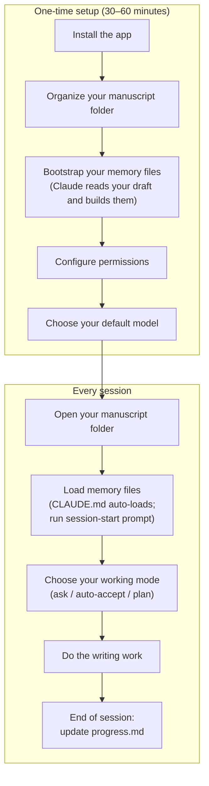

# Claude Code for Writers: A Practical Guide

## Before You Begin

This guide is written for Tim — a non-technical author with a finished first draft who wants to use Claude Code as a serious revision and writing partner. You don't need to know anything about programming, terminals, or code. Everything is plain English, step by step.

There are two parts to getting started: a **one-time setup** that takes roughly 30–60 minutes, and a **repeatable daily workflow** you'll use every session after that. The setup is front-loaded on purpose — doing it right the first time means every session after is fast and frictionless.

**Read this guide top to bottom before you do anything.** The sections build on each other. If you jump ahead to "Basic Usage" without doing the setup first, Claude won't know anything about your book and you'll spend the first ten minutes of every session re-explaining it.

Here's the full picture of where you're going:



---

### If you get stuck

Don't struggle alone. Claude Code is well-documented and the broader AI community knows it well — if something isn't working, **ChatGPT, Grok, or any other AI assistant can help you troubleshoot** just by describing what's happening.

That said, once Claude Code is up and running, **ask it first.** Claude Code is remarkably good at diagnosing its own issues. Describe what went wrong, and it will typically propose a fix and apply it itself. Nine times out of ten, that's all you need.

---

## Table of Contents

1. [What is Claude Code?](#1-what-is-claude-code)
2. [What Claude Code Cannot Do](#2-what-claude-code-cannot-do)
3. [Installing Claude Code](#3-installing-claude-code)
4. [Organizing Your Manuscript Folder](#4-organizing-your-manuscript-folder)
5. [Setting Up Claude's Memory](#5-setting-up-claudes-memory)
6. [Configuring Permissions](#6-configuring-permissions)
7. [Choosing the Right Model](#7-choosing-the-right-model)
8. [Your First Session](#8-your-first-session)
9. [Practical Workflows for Book Writing](#9-practical-workflows-for-book-writing)
10. [Prompting Tips](#10-prompting-tips)
11. [Example Prompts to Copy and Use](#11-example-prompts-to-copy-and-use)

---

## 1. What is Claude Code?

Claude Code is an AI writing partner that runs as a desktop app on your computer. Think of it like a very capable collaborator you can have a conversation with — one who can read your drafts, help you brainstorm, suggest edits, and talk through story problems with you.

The key difference between Claude Code and a web chatbot like Claude.ai is that Claude Code runs on your own computer and can directly read and work with your manuscript files. You don't have to copy and paste anything into a browser tab. You can say "read chapter three and tell me if the pacing feels slow" — and it will actually open the file and read it.

It's also aware of your whole writing folder at once. If you ask it to check whether a character detail in chapter eight is consistent with what you established in chapter two, it can read both files and compare them. That kind of whole-manuscript awareness is what makes it genuinely useful for long-form book work.

---

## 2. What Claude Code Cannot Do

Honest expectations matter. Read this before investing time in the setup — so you know exactly what you're getting.

**It doesn't browse the internet.** By default, Claude Code cannot look up facts, check historical details, or verify real-world information. If you ask "what was the weather in Paris on D-Day?" it will give you its best answer from its training data — which may be accurate or may not be. Always verify factual claims through your own research.

**It doesn't know your book unless you tell it — but this is fixable.** Every session starts fresh. Claude Code has no memory of previous conversations unless you load your reference files. This is exactly why Section 5 exists: with `CLAUDE.md`, `book-bible.md`, and `progress.md` in place and loaded at the start of each session, this limitation largely disappears.

**It can't replace your judgment.** Claude Code will sometimes give suggestions that are competent but generic. It can produce prose that sounds fine but has no soul. Your job is to be the author — to know when something is right and when it isn't, and to push back until it gets there or write it yourself.

**It doesn't know your readers.** It has no idea who your audience is unless you tell it. Be explicit: "This is for readers of upmarket women's fiction in their 40s" or "My audience is teenage boys who love survival stories." Better yet, add your intended audience to `CLAUDE.md` so Claude always knows.

**It can be confidently wrong about facts.** Especially for anything historical, scientific, or legal. Treat factual content from Claude Code as a first draft to be checked, not a source of truth.

**It can't make the final calls.** It can suggest three ways a chapter could end, but it cannot tell you which one is right for your book. That's yours.

---

## 3. Installing Claude Code

### What you'll need first

- A computer running macOS or Windows (Linux is not currently supported)
- An internet connection
- A **paid Claude subscription** — Pro, Max, Team, or Enterprise (see note below)

> **A note on cost:** Claude Code requires a paid Claude subscription. As of 2025, the Pro plan is $20/month. This is the same account you'd use at [claude.ai](https://claude.ai). If you're already a Claude subscriber, you're all set. If not, you'll need to sign up at [claude.ai](https://claude.ai) before proceeding.

---

### On macOS

**Step 1: Download the app**

Go to [claude.ai/download](https://claude.ai/download) and download the macOS version. It will download a `.dmg` file — the same kind of installer used for most Mac apps.

**Step 2: Install it**

Open the downloaded `.dmg` file. A window will appear asking you to drag the Claude icon into your Applications folder. Do that, then open your Applications folder and double-click Claude to launch it.

**Step 3: Sign in and open Claude Code**

Sign in with your Anthropic account. Once you're in, look for the **Code** tab at the top of the window and click it. This is the Claude Code interface.

---

### On Windows

**Step 1: Download the app**

Go to [claude.ai/download](https://claude.ai/download) and download the Windows version. It will download a `.exe` installer file.

**Step 2: Install it**

Double-click the downloaded file and follow the installer prompts. Accept the defaults — there's nothing unusual to configure.

**Step 3: Install Git (one-time setup)**

Claude Code on Windows requires Git, a free tool, to be installed separately. Go to [git-scm.com](https://git-scm.com) and download the Windows version. Run the installer and accept all the defaults.

**Step 4: Sign in and open Claude Code**

Launch Claude from your Start menu. Sign in with your Anthropic account, then click the **Code** tab at the top of the window.

---

## 4. Organizing Your Manuscript Folder

This step comes before your first session because Claude Code needs to know where your files live — and a well-organized folder makes every interaction faster and cleaner.

### How to organize your manuscript

Claude Code works well with plain text files. The two most common formats are:

- `.txt` — plain text, readable anywhere
- `.md` — Markdown, which is plain text with some simple formatting (headers, bold, italics)

A simple folder structure might look like this:

```
my-novel/
  chapter-01.md
  chapter-02.md
  chapter-03.md
  characters.md
  timeline.md
  notes.md
```

Each chapter in its own file. A separate file for your character notes and timeline. This keeps things organized and makes it easy to ask Claude Code to work on one piece at a time.

### Asking Claude Code to read a file

Once you've opened your writing folder in Claude Code, you can ask it to read any file in it:

> "Read chapter-01.md and summarize what happens."

> "Read characters.md so you understand my cast, then read chapter-05.md and tell me if Marcus's behavior is consistent with his description."

> "Read all the chapter files and give me an overview of the story's structure."

### Asking Claude Code to write to a file

You can also ask Claude Code to save its output directly to a file:

> "Write a draft of chapter six based on the outline I gave you and save it as chapter-06.md."

> "Add a new entry to characters.md for the new character we just discussed — Sarah, the protagonist's college roommate."

Always review anything Claude Code writes to a file. It's a collaborator, not a final authority.

### A note on backups

Before you ask Claude Code to edit any file, make sure you have a backup. The easiest approach is to keep your manuscript in a folder synced to iCloud, Google Drive, or Dropbox — that way you have a version history even if something goes wrong.

---

## 5. Setting Up Claude's Memory

Claude Code doesn't remember your book between sessions. Every time you start a new session, it's starting from scratch. This is the biggest practical limitation for long-form writing work — but it's entirely solvable if you build a small set of reference files and tell Claude to read them at the start of every session.

This section explains the system: what files to create, what to put in them, and exactly how to use them.

---

### If you already have a draft: let Claude build the files for you

If your manuscript already exists — even as a rough first draft — you don't need to fill in these reference files by hand. Claude can read your chapters and build them for you. This is the fastest way to get started.

**Step 1: Put your chapters in one folder**

Copy all your chapter files into a single writing folder. Plain text (`.txt`) or Word documents converted to text work fine. If your chapters are in a Word document, use File → Save As and choose "Plain Text (.txt)" for each one, or save the whole manuscript as one file.

**Step 2: Open the folder in Claude Code and run the bootstrap prompts**

Start a new session, select your writing folder, and use these prompts in order. Don't rush — read what Claude produces before moving to the next step.

First, have Claude read everything:

```
Read all the chapter files in this folder. Take your time — I want you to read the complete manuscript before we do anything else. When you're done, just say "done reading" and wait for my next instruction.
```

Then ask it to build the book bible:

```
Based on everything you just read, create a file called book-bible.md. It should include:
- A list of every named character with their age, role, physical description, personality, and key relationships
- A chronological timeline of events (both backstory and events that happen during the book)
- A description of each major setting
- The central themes as you understand them from the text
- A list of established facts I should never contradict (specific details about characters, places, or events that are clearly fixed)

Where you're uncertain about a detail, write "[unclear — confirm with author]" rather than guessing. I will review and correct the file after you create it.
```

Then ask it to assess your progress:

```
Now create a file called progress.md. It should include:
- A chapter-by-chapter status table (mark each chapter as "First draft" for now)
- A brief one-sentence summary of what happens in each chapter
- Any structural observations — chapters that feel underdeveloped, pacing issues, unresolved plot threads, or places where the story seems to jump
- A section called "Open questions" listing anything that seems unresolved or inconsistent across the manuscript

Again, note uncertainty rather than inventing. I'll use this as a starting point for our revision work.
```

Finally, create your standing instructions:

```
Create a file called CLAUDE.md with the following sections, based on what you've learned from reading the manuscript:
- A brief description of what this book is (genre, setting, premise, tone)
- Your read on my voice and style — what makes it distinctive, what I seem to prioritize
- A placeholder section called "How I want you to behave" with some sensible defaults — I'll fill this in myself

Leave the behavior section minimal. I want to write that part.
```

**Step 3: Review and correct**

Claude will get most things right, but it will also miss things, misread details, or flag uncertainty where you actually have a clear answer. Go through each file and:

- Fix anything that's wrong
- Fill in the `[unclear — confirm with author]` gaps
- Add anything important that Claude didn't pick up
- Write your own "How I want you to behave" section in `CLAUDE.md`

This review pass is important. The files are only as reliable as the information in them — taking 30 minutes now to correct Claude's first draft saves hours of inconsistency later.

**Step 4: You're set up**

From this point forward, use the standard session-start prompt at the top of every session:

```
Read CLAUDE.md, book-bible.md, and progress.md. Give me a status summary and tell me what we should work on next.
```

---

### The Three Files You Need

Create these three files inside your writing folder. You don't have to fill them all in at once — start with what you know and add to them as the book grows.

```
my-novel/
  CLAUDE.md            ← Claude reads this automatically every session
  book-bible.md        ← characters, setting, timeline, themes, voice
  progress.md          ← where you are, what's been edited, what's next
  chapter-01.md
  chapter-02.md
  ...
```

---

### CLAUDE.md — Your Standing Instructions

`CLAUDE.md` is a special file. Claude Code automatically reads it every time you start a session in that folder. You don't have to ask — it just happens.

This is where you put rules for how Claude should behave as your writing partner. Think of it as the instruction sheet you'd hand a new assistant on their first day.

**Create a file called `CLAUDE.md` in your writing folder with content like this:**

```markdown
# My Novel — Claude Instructions

## What this project is
I am writing a literary novel called *The Distance Between Us*.
It is a multigenerational family drama set between 1960s rural Mississippi and present-day Chicago.
The themes are: inherited trauma, forgiveness, land and belonging, silence as survival.

## My voice and style
- First-person, past tense, from the POV of the adult daughter (Celia)
- Literary but accessible — think Jesmyn Ward, not Cormac McCarthy
- Emotional restraint: show, don't tell. No melodrama.
- Short chapters. White space matters. Dialogue is sparse but loaded.

## How I want you to behave
- Always read `book-bible.md` and `progress.md` at the start of each session before doing anything else.
- When I ask for feedback, give me honest notes first — don't rewrite unless I ask.
- Never change a character's name, age, or backstory without asking me first.
- If you're uncertain about a fact in the book (a date, a detail, a character trait), ask me — don't invent.
- When you draft new prose, match my voice. Don't make it sound like a writing exercise.
- Keep responses concise. I don't need long preambles — just the work.

## What I do NOT want
- Generic writing advice ("show don't tell", "vary your sentence length") unless I ask for it
- Cheerful affirmations before every response
- Suggestions to add more backstory or explanation — I prefer underwriting to overwriting
```

You can rewrite this entirely to fit your own book and preferences. The key sections to always include are:
- What the book is (genre, setting, premise)
- Your voice and style (with reference points if you have them)
- Rules for how Claude should behave
- What you don't want

As you learn what works and what annoys you, update `CLAUDE.md`. It's a living document.

---

### book-bible.md — The Source of Truth for Your Book

This file is your book's internal encyclopedia. Claude can't know your characters, your world, or your established facts unless they're written down somewhere. This is that place.

**Example structure:**

```markdown
# Book Bible — The Distance Between Us

## Characters

### Celia Marsh (protagonist, narrator)
- Age: 38 at the start of the present-day timeline
- Grew up in Coahoma County, Mississippi; now lives in Chicago's South Side
- Works as a high school history teacher
- Estranged from her mother, Ida, for 12 years following a fight over the family land
- Has a daughter, Mara (age 9), who has never met her grandmother
- Drives a navy blue Honda Civic, perpetually needs an oil change
- She doesn't cry in front of people. Ever.

### Ida Marsh (Celia's mother)
- Age: 67
- Still lives on the family farm in Coahoma County
- Has kept secrets about the land's history that Celia is only beginning to uncover
- Speaks in short sentences. Rarely explains herself.
- Has a bad hip she refuses to have treated
- Grows tomatoes obsessively

### Marcus Webb (Celia's ex-husband)
- Age: 41
- They divorced four years before the novel starts
- Amicable divorce — they co-parent Mara well
- He remarried. His new wife's name is Diane.
- He appears in chapters 3, 7, and 14

## Timeline

- **1962:** Ida's parents acquire the land through circumstances Ida won't discuss
- **1989:** Celia is born
- **2007:** Celia leaves Mississippi for Chicago
- **2011:** Celia and Marcus marry
- **2015:** Mara is born
- **2019:** Celia and Marcus divorce
- **2021:** Ida's neighbor offers to buy the land — Celia finds out by accident
- **Present day (2024):** Novel begins with Celia receiving a letter from a lawyer

## Setting

### The Farm (Coahoma County, Mississippi)
- 40 acres, mostly fallow now
- White clapboard farmhouse, front porch with a broken second step (never fixed)
- A pecan tree in the backyard that Celia used to climb

### Celia's Apartment (Chicago)
- Logan Square neighborhood, third-floor walkup
- Mara has the bigger bedroom; Celia has the smaller one
- There's a crack in the kitchen ceiling shaped like a river

## Themes
- Inherited trauma and how it travels through generations without being named
- The violence of silence within families
- Land as memory, as identity, as wound
- What it means to forgive someone who was just trying to survive

## Established Facts (don't contradict these)
- Ida has never been to Chicago
- Celia owns a car but rarely uses it in the city
- The family has no living relatives on Ida's side except a distant cousin named Roy
- The lawyer's name is Harold Finch
```

You don't need all of this on day one. Start with what you know, and add to it as you make decisions in the book. Whenever you establish something new — a character detail, a date, a place — add it here.

**Example prompt to ask Claude to update this file after a session:**

```
We just established several new details today. Please update book-bible.md to reflect:
- Ida's neighbor's name is Earl Pruitt, not "the neighbor"
- The letter Celia receives in chapter 1 is dated October 14, 2024
- Marcus drives a white Ford F-150
```

---

### progress.md — Where You Are and What's Next

This file is a running log of your editing and drafting progress. It helps Claude (and you) know what's been done, what's in-progress, and what decisions are still open.

**Example structure:**

```markdown
# Progress Log — The Distance Between Us

## Current status
Working on: Chapter 7 (first draft)
Last session: Revised chapters 4 and 5. Pacing in chapter 5 still feels slow — flagged for another pass.

## Chapter status

| Chapter | Status      | Notes                                              |
|---------|-------------|----------------------------------------------------|
| 1       | Revised     | Final. Don't touch.                                |
| 2       | Revised     | Final. Don't touch.                                |
| 3       | Revised     | One scene still weak — the phone call with Marcus  |
| 4       | Revised     | Final.                                             |
| 5       | Revised     | Pacing in middle section still slow — needs pass   |
| 6       | First draft | Rough. Needs full revision.                        |
| 7       | In progress | Currently drafting                                 |
| 8–14    | Not started |                                                    |

## Open questions / unresolved decisions
- Do we ever learn exactly how Ida's parents got the land? Or does it stay ambiguous?
- Chapter 9 needs a scene that connects Mara to the land — haven't figured out what yet
- The ending: Celia returns to the farm but the question is whether Ida is alive or has just died

## Voice notes
- Chapter 3 got too sentimental in the second half — watch for this pattern going forward
- The flashback sections (1962) should feel slightly more formal in diction than the present-day sections

## What to do next
1. Finish chapter 7 first draft
2. Revise chapter 5 pacing
3. Revisit the phone call scene in chapter 3
```

Update this file at the end of every session. A good habit is to end each session with:

```
Update progress.md to reflect what we did today and what I should work on next.
```

---

### Starting Every Session Right

Once these three files exist, use this as your standard opening prompt at the start of every session:

```
Read CLAUDE.md, book-bible.md, and progress.md. Then tell me what we worked on last time and what's up next. Don't start any work yet — just confirm you've read everything and give me a quick status summary.
```

This takes 30 seconds and ensures Claude is fully oriented before any work begins. You'll catch it immediately if something is out of date.

---

### Keeping the Files Current

The system only works if you maintain it. Here are the three habits that make the difference:

**At the end of every session:**

```
Before we close: update progress.md with what we accomplished today and flag any new open questions. Also update book-bible.md if we established any new character details, dates, or world facts.
```

**When you make a significant creative decision:**

```
I've decided that [decision]. Please add this to book-bible.md under the appropriate section and note it as established canon.
```

**When you want to verify Claude hasn't drifted:**

```
Read book-bible.md and then read chapter-08.md. Flag any details in chapter 8 that contradict what's in the bible — character names, ages, timeline dates, anything.
```

---

### A Note on Long Sessions

Even with good reference files, Claude Code has a context limit — if a session goes very long (hours of back-and-forth), it may start to forget details from earlier in the conversation. This isn't a bug you can fix. The solution is simple: when a session gets long, start fresh.

```
Let's start a new session. Read CLAUDE.md, book-bible.md, and progress.md to get back up to speed.
```

Starting fresh with your reference files loaded is always better than pushing a long session past its limits.

---

## 6. Configuring Permissions

When Claude Code wants to make a change to one of your files, it asks your permission first. This is a safety net — you see what's about to happen before it happens. But if Claude is stopping to ask after every single sentence it edits, that friction adds up fast and breaks your flow.

This section explains how the permission system works and how to tune it so Claude can work more fluidly without stopping constantly.

---

### What triggers a permission prompt

Not everything Claude does requires your approval. Here's how it breaks down for writing work:

**Never prompts — always silent:**
- Reading any of your files
- Searching your folder for a file name or phrase

**Prompts by default:**
- Editing or writing to a file
- Running any kind of system command (saving via git, running a script, etc.)

For most writing sessions, the prompts you'll actually encounter are file edits. Every time Claude proposes a change to a chapter or notes file, it will pause and wait for you to accept or reject.

---

### The three modes you'll use

Claude Code has a mode selector right next to the send button in the chat interface. You can switch modes at any time — even mid-session.

**Ask permissions (default)**
Claude pauses and asks before every file edit. Good for the first time you work on something important, or when you want to review every change closely.

**Auto accept edits**
Claude applies file edits without asking. It will still pause for anything beyond file edits (like running a system command). This is the mode you'll want for most writing sessions — you can review what changed afterward by scrolling back through the conversation, and your cloud backup (iCloud, Dropbox, etc.) means you can always recover a previous version.

**Plan mode**
Claude can only read your files — it cannot change anything. Use this when you want to explore or discuss without any risk of edits happening. Good for "just look at my outline and tell me what you think" sessions.

To switch: click the mode selector next to the send button and choose the mode you want. You can also press **Shift+Tab** to cycle through modes quickly.

---

### Setting a default mode for your writing folder

If you find yourself switching to "Auto accept edits" every session, you can make it the default for your writing folder so it's already set when you open Claude Code.

Create a file called `settings.json` inside a folder named `.claude` in your writing folder:

```
my-novel/
  .claude/
    settings.json
  CLAUDE.md
  book-bible.md
  chapter-01.md
  ...
```

The contents of `settings.json`:

```json
{
  "permissions": {
    "defaultMode": "acceptEdits"
  }
}
```

Save the file. Now every time you open this folder in Claude Code, it will default to auto-accepting edits. You can still switch to a different mode at any time during a session.

---

### Pre-approving specific actions

If Claude keeps stopping to ask about something specific — like saving a file to a particular folder, or running a specific command you've told it to use — you can pre-approve that exact action so it never prompts again.

You do this in the same `settings.json` file using an `allow` list:

```json
{
  "permissions": {
    "defaultMode": "acceptEdits",
    "allow": [
      "Bash(git add *)",
      "Bash(git commit *)",
      "Bash(git status)"
    ]
  }
}
```

This example pre-approves git commands — useful if you've asked Claude to help track your manuscript changes with git. Claude will run those exact commands without asking. Everything else still follows the default mode.

**For a writing-only workflow, common things worth pre-approving:**

```json
{
  "permissions": {
    "defaultMode": "acceptEdits",
    "allow": [
      "Bash(git add *)",
      "Bash(git commit *)",
      "Bash(git status)",
      "Bash(git diff *)"
    ]
  }
}
```

---

### Blocking actions you never want Claude to take

You can also create an explicit deny list — things Claude should never do, no matter what mode you're in or what you ask. Deny rules always win, even over allow rules.

```json
{
  "permissions": {
    "defaultMode": "acceptEdits",
    "allow": [
      "Bash(git add *)",
      "Bash(git commit *)",
      "Bash(git status)"
    ],
    "deny": [
      "Bash(rm *)"
    ]
  }
}
```

The `deny` entry above ensures Claude can never run a delete command, even if you accidentally ask it to. For a writing workflow, you probably don't need a deny list — but it's there if you want it.

---

### When a new permission prompt keeps interrupting you

If Claude starts asking about something repeatedly that you've already approved once in your head, the fastest fix is to add it to the `allow` list in `settings.json`. The pattern is straightforward:

1. Note exactly what Claude asked to do (the prompt will show the command or action)
2. Open `.claude/settings.json` in any text editor
3. Add that action to the `allow` array
4. Save the file — takes effect immediately in the next session

To remove a rule later, just delete that line from the `allow` array and save.

---

### The safe default for most writing sessions

If you're not sure how to configure this, start here and adjust as needed:

```json
{
  "permissions": {
    "defaultMode": "acceptEdits"
  }
}
```

This gives you fluid file editing without constant interruptions, while still pausing for anything beyond basic file changes. Your cloud sync is your safety net — if Claude edits something you didn't want edited, your backup service has a previous version you can restore.

---

## 7. Choosing the Right Model

When you start a session in Claude Code, you can choose which AI model powers it. Think of models like different modes on the same collaborator — same person, different levels of depth and speed.

Claude currently offers three main models:

| Model | Best for | Speed | Cost |
|---|---|---|---|
| **Claude Opus** | Deep creative work, complex feedback, long sessions | Slower | Higher |
| **Claude Sonnet** | Everyday writing tasks, drafting, brainstorming | Fast | Moderate |
| **Claude Haiku** | Quick tasks, simple edits, fast iteration | Fastest | Lower |

### Which model should you use for book writing?

**For most writing sessions, Sonnet is the right choice.** It's fast, capable, and handles the vast majority of writing tasks — feedback, drafts, rewrites, brainstorming — with excellent quality. You won't notice a meaningful difference between Sonnet and Opus for most everyday work.

**Use Opus when the stakes are higher:**
- You want the most nuanced developmental feedback on a chapter
- You're working through a complex structural problem (does this plot thread actually resolve?)
- You're asking Claude to analyze your voice across multiple chapters and identify patterns
- You want the deepest possible engagement with a difficult passage

**Use Haiku when speed matters more than depth:**
- Quick line edits on a short paragraph
- Generating ten title options to pick from
- A fast brainstorm you just need to skim
- Anything where you just want raw material to react to, not considered advice

### How to switch models

In the Claude Code desktop app, look for a model selector in the interface — typically a dropdown near the chat input. You can switch models between sessions or even mid-conversation if the task changes.

### A practical recommendation

Start with Sonnet as your default. When you sit down for a serious revision session — the kind where you're really wrestling with whether a chapter is working — switch to Opus. You'll notice the difference in that context. For quick tasks throughout the day, Haiku keeps things moving without burning through your usage.

If you find yourself on a usage limit, drop to Sonnet or Haiku for lighter tasks and save Opus for the moments that deserve it.

---

## 8. Your First Session

You've installed the app, organized your folder, set up your memory files, configured permissions, and chosen a model. Now you're ready to actually use it.

### Opening your writing folder

The first thing you do each session is tell Claude Code where your manuscript lives.

In the **Code** tab, click **Select folder**, then navigate to your writing folder and click Open. Claude Code will now have access to all the files in that folder.

> **Tip:** Keep all your manuscript files — chapters, notes, outlines — in one folder. This lets Claude read any file without you having to locate it manually.

### Having a conversation

Once your folder is open, you'll see a text box at the bottom of the screen. This is where you talk to Claude Code — in plain English, just like texting or emailing.

Type what you want and press Enter (or click the send button). For example:

```
I'm writing a literary novel set in 1970s Chicago. My protagonist is a jazz musician who is losing his hearing. What are some themes I could explore in this story?
```

Claude Code will respond in the conversation panel. You read its response, then type your next message.

### When Claude wants to edit a file

If you ask Claude to make changes to one of your files — rewrite a paragraph, add a character to your notes, etc. — it will show you exactly what it plans to change before doing anything. You'll see the original text and the proposed change side by side, with additions highlighted in green and removals in red.

You can **Accept** the change, **Reject** it, or ask Claude to try again. Nothing happens to your files until you approve it.

### Picking up where you left off

When you reopen Claude Code and select the same folder, you start a fresh session — Claude won't remember the previous conversation. This is expected behavior. You already set up these files in Section 5 — use the session-start prompt there at the beginning of every session.

---

## 9. Practical Workflows for Book Writing

Your `book-bible.md` is already set up from Section 5 — Claude will have your characters, timeline, settings, and established facts loaded at the start of every session. The workflows below assume that's in place.

---

### Drafting new chapters or sections

Describe what you want the chapter to accomplish — the emotional arc, key events, who's in the scene, what needs to be established — and ask Claude Code to write a draft.

> "Write a first draft of a scene where Maya confronts her estranged father at her mother's funeral. She's holding back tears but trying to appear cold. Her father keeps making it about himself. About 800 words."

Don't worry about it being perfect. The goal is to get words on the page that you can react to, revise, and make your own.

---

### Getting feedback on existing prose

Type a passage directly into the chat box (or ask Claude Code to read one of your files) and ask for specific feedback.

> "Here's the opening of my second chapter. Does the voice feel consistent with the first chapter? Is anything unclear?"

You can also ask for line edits:

> "Edit this paragraph for clarity and flow. Don't change the meaning — just smooth it out."

Or ask for a more substantial rewrite:

> "Rewrite this scene from Marcus's point of view instead of third-person. Keep the same events."

---

### Structural feedback

You can ask Claude Code to look at a chapter or outline and give you structural notes — the kind of big-picture feedback a developmental editor would give.

> "Read chapter four and tell me: does the pacing feel right? Is there anything that drags? Does the ending of the chapter give a reason to keep reading?"

> "Here's my chapter outline. Does the structure make sense? Are there any chapters that seem out of place or redundant?"

---

### Maintaining consistency

If you tell Claude Code about your characters, world, and established details, it can help you catch inconsistencies.

> "Here are the key facts about my protagonist, Daniel: he's 42, grew up in New Orleans, lost his brother in 2005, and drives a green pickup truck. Read this chapter and flag anything that contradicts these facts."

Your `book-bible.md` handles this automatically — Claude reads it at the start of every session, so you never have to re-explain your characters.

---

### Brainstorming

Claude Code is a very capable brainstorming partner. Use it freely.

> "Give me ten possible titles for a memoir about growing up with an alcoholic parent. The tone is honest but not bleak — there's humor and resilience in the story."

> "I'm stuck on what happens after the protagonist discovers the letter. Give me five different directions the story could go from here."

> "What are some ways to open a chapter that immediately creates a sense of dread without explaining why?"

---

### Iterating on a passage

This is where Claude Code really shines. You can take the same passage and try it multiple ways quickly.

> "Rewrite this paragraph in a more conversational tone — like the narrator is telling this story to a friend over coffee."

> "Make this scene more tense. The reader should feel like something is about to go wrong, even though nothing does yet."

> "The dialogue in this exchange feels too formal. Loosen it up — people interrupt each other, they don't always finish sentences."

---

### Getting unstuck

Every writer hits walls. Claude Code can help you push through.

> "I'm stuck on this scene. My character needs to make a decision that will change everything, but I don't want it to feel contrived. Give me three different ways this could play out, each with a different emotional logic."

> "I've been staring at this chapter ending for a week. Here it is. What's not working? What are some alternatives?"

> "I know what needs to happen in this chapter, but I don't know how to start it. Give me three possible opening lines."

---

## 10. Prompting Tips

The quality of what you get out of Claude Code depends heavily on what you put in. Here are principles that apply specifically to writing work.

### Be specific about what you want

Vague: "Make this chapter better."

Specific: "This chapter feels slow in the middle section. The dinner party scene goes on too long. Can you suggest cuts or tighten the dialogue to keep the scene moving?"

### Give context — or better, let your reference files do it

If you've set up `CLAUDE.md` and `book-bible.md` as described in Section 5, Claude already has the context it needs at the start of every session. You don't have to re-explain your book each time.

If you haven't set those files up yet, give a brief summary at the start of any significant session:

> "I'm working on a historical novel set in 1940s Paris. My protagonist is a French-Algerian woman named Amira who works as a translator for the Resistance. The tone is literary — think Elena Ferrante meets All the Light We Cannot See. Here's the chapter I want to work on..."

### Tell it the tone, voice, and genre

Don't assume it knows. Say:

> "The book's voice is first-person, present tense, darkly funny. The narrator is unreliable and self-aware."

> "This is a middle-grade adventure novel. The prose should be punchy, age-appropriate, and fun — not dumbed down."

### Ask for options, not just one answer

Instead of asking for a rewrite, ask for three versions:

> "Give me three different versions of this opening paragraph — one that leads with action, one that leads with mood, one that leads with a specific detail."

Then pick the one you like, or combine elements from all three.

### Tell it what NOT to do

> "Rewrite this scene, but don't change the ending — I want to keep that last line exactly as it is."

> "Give me feedback on this chapter. Don't comment on the plot — just focus on sentence-level prose."

### Push back and iterate

If the first response isn't right, say so:

> "This is too formal. Make it sound more like a working-class narrator from the South — not a caricature, but with that flavor."

> "The rewrite lost something I liked about the original. Can you try again, keeping the original's rhythm but simplifying the vocabulary?"

---

## 11. Example Prompts to Copy and Use

These are ready-to-use prompts. Modify the details to fit your project.

---

**Starting a session (with memory files set up — see Section 5):**

```
Read CLAUDE.md, book-bible.md, and progress.md. Then give me a quick status summary and tell me what we should work on next.
```

**Starting a session (without memory files):**

```
I'm working on a [genre] novel. Here's a brief summary: [paste your summary]. My protagonist is [name], a [description]. The tone is [describe tone]. I'd like to work on [chapter/scene/problem] today.
```

---

**Drafting a scene:**

```
Write a first draft of a scene where [character] does [action]. The setting is [place and time]. The emotional undercurrent should be [feeling]. The scene should end with [outcome or image]. Aim for about [word count] words.
```

---

**Getting feedback:**

```
Read the following passage and give me honest feedback. Focus on: (1) pacing, (2) whether the dialogue sounds natural, and (3) anything that confused you. Don't rewrite it yet — just give me notes.

[paste your passage]
```

---

**Asking for line edits:**

```
Edit the following passage for clarity and rhythm. Keep my voice and meaning intact — I'm not looking for a rewrite, just polish. Flag any sentences that feel awkward.

[paste your passage]
```

---

**Consistency check (with book-bible.md set up):**

```
Read book-bible.md, then read [chapter-XX.md]. Flag any details in the chapter that contradict what's in the bible — character names, ages, timeline dates, established facts.
```

**Consistency check (without book-bible.md):**

```
Here are the established facts about my main character:
- Name: [name]
- Age: [age]
- Background: [background]
- Key personality traits: [traits]
- Physical description: [description]

Read [chapter file name] and flag any moments where the character's behavior, speech, or description contradicts these facts.
```

---

**Brainstorming chapter titles:**

```
Here are the key events and emotional arc of my next chapter: [brief description]. Give me ten possible chapter titles. Some should be literal, some evocative, some ironic.
```

---

**Getting unstuck:**

```
I'm stuck. Here's the situation: my character [name] has just [event]. I know I need to get to [future event] eventually, but I don't know what happens in between. Give me three different paths the story could take, each with a different emotional logic.
```

---

**Iterating on tone:**

```
Here's a passage I've written:

[paste your passage]

Now rewrite it two ways: first, in a more urgent, almost breathless tone — shorter sentences, higher stakes feeling. Second, in a slower, more reflective tone — like the narrator is looking back on this moment years later.
```

---

**Asking for structural feedback:**

```
I'm going to paste my chapter outline below. Please read it and tell me: Does the structure make sense? Are there any chapters that seem to repeat or cover the same ground? Does the overall shape build toward a satisfying ending? Be honest.

[paste your outline]
```

---

## A Final Note

Claude Code is a tool, not a ghostwriter. The best way to use it is as a collaborator who handles the mechanical labor — drafting options, flagging problems, offering alternatives — so you can focus on the decisions that only you can make.
